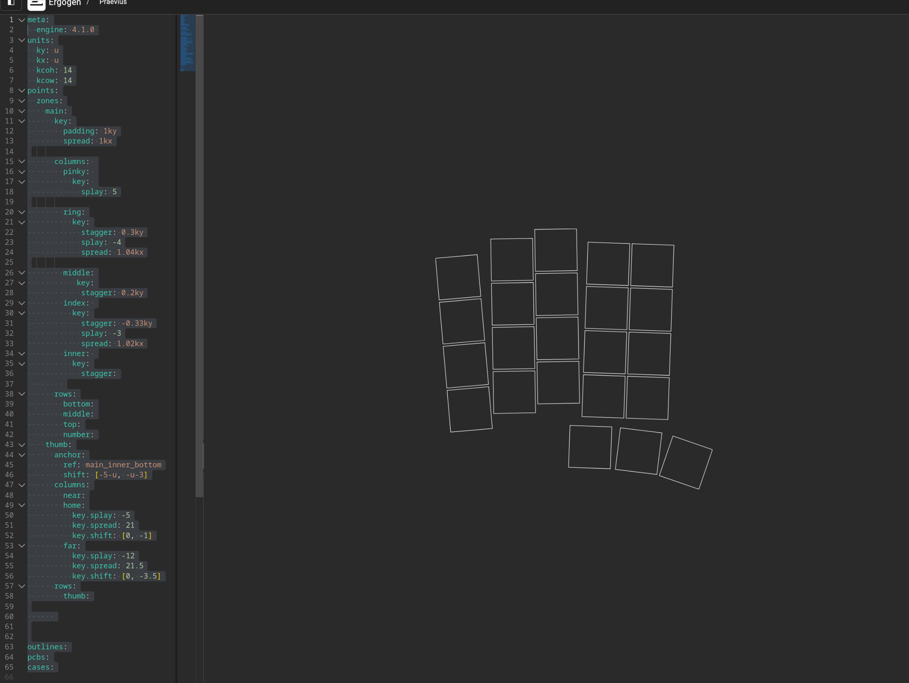
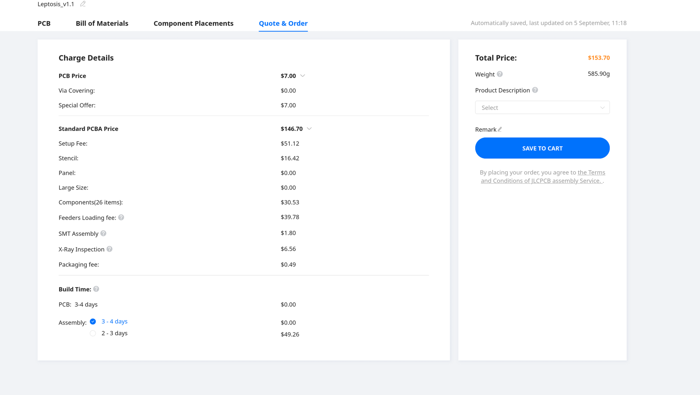
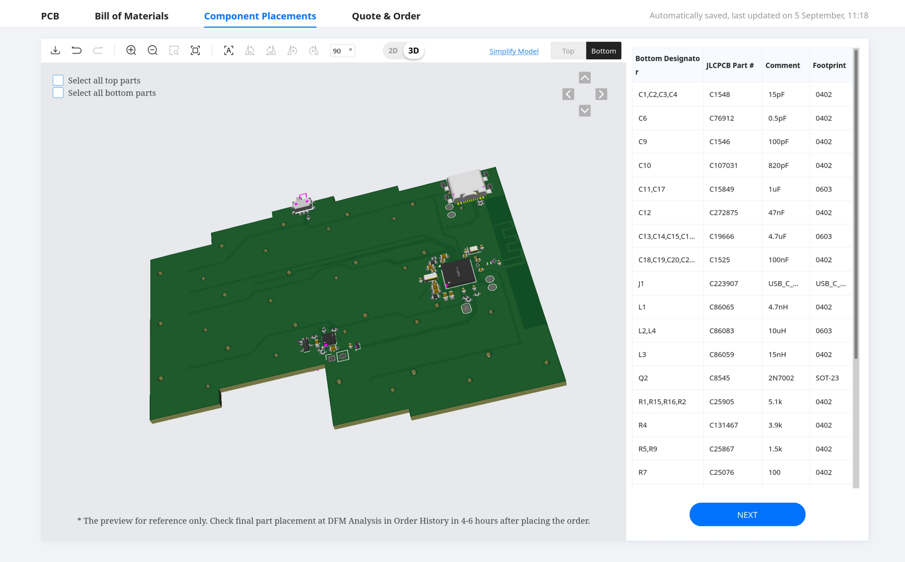
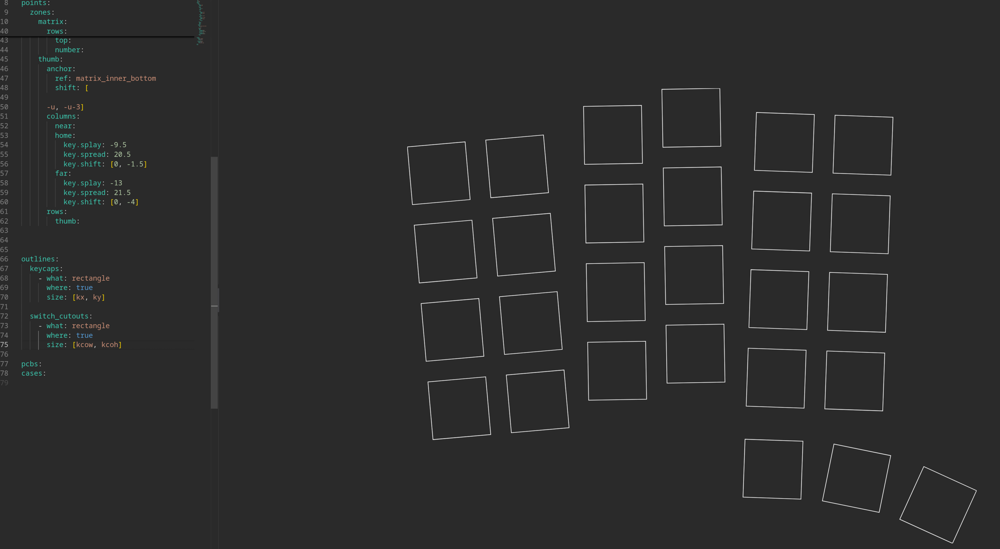
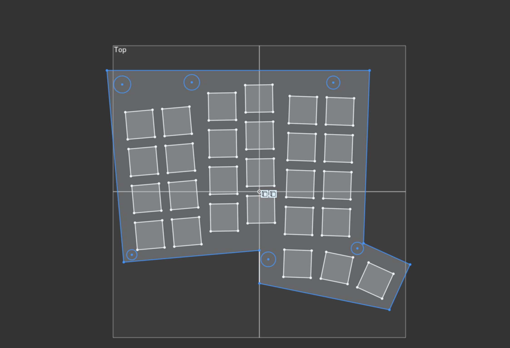
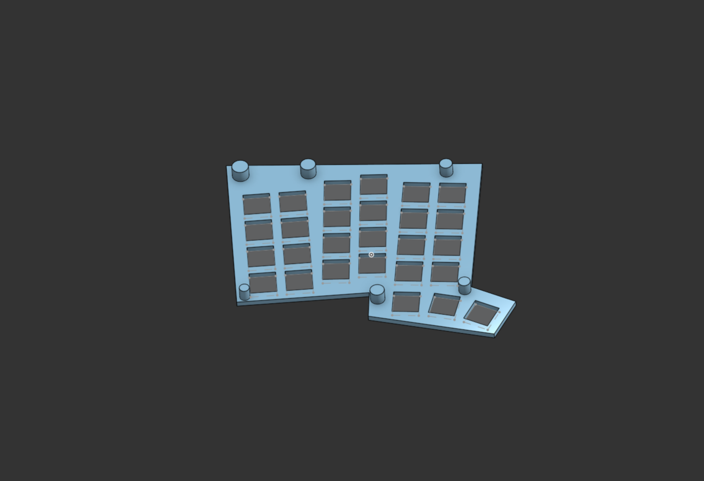
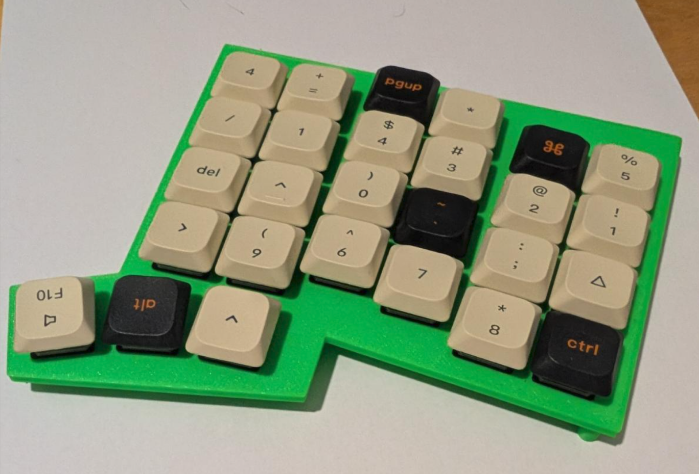
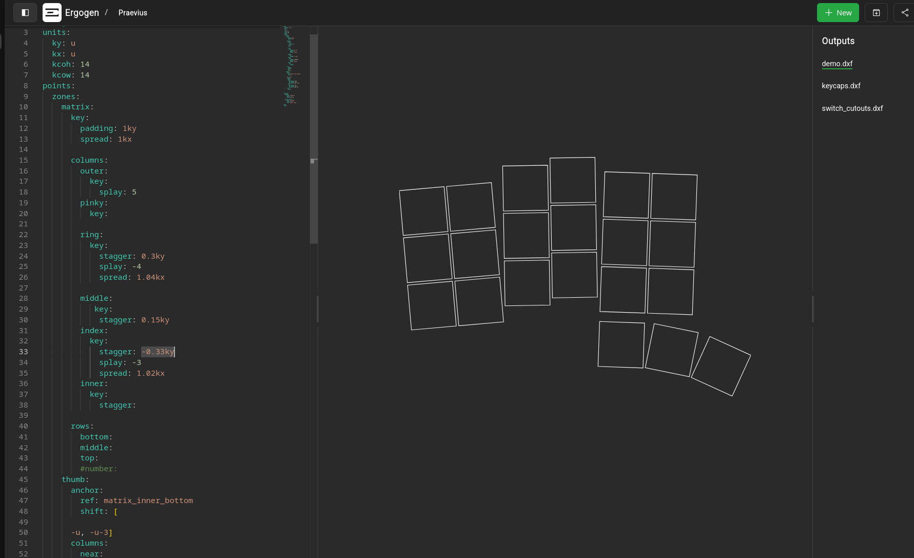

# September 4: Initial Constraints

This keyboard needs to:
- be low-profle 
- use an onboard nrf52840 chip
- be wireless
- use the TPS65 touchpad

 In regards to the layout, I want something more "conservative" than Quaero. The layout of Fulmen was basically almost perfect for me, except the index columns and rather low thumb row. So something with little to none splay, as it needs to be comfortable for my father as well. And maybe a detachable number row, same as I did with Quaero, but with more mousebites so that the PCB actually still looks decent with the number row removed. So I guess something similar to the ZSA Voyager but with more thumb keys. Might have to make one or two thumb keys detachable as well, as I personally prefer three while my father wants more. Also Chocs (either v2 or v1) will probably the best option. ULPs look interesting, but I think I'd be sacrificing switch feel for height. Plus they're more expensive.  
 The aforementioned chip unfortunately only comes in an aQFN package, so the only options would be PCBA or using a hot air station. Been thinking that I could try and get only the chip PCBA-ed, and then hand-solder the rest. That would require the rest of the components to have big enough packages, and for having only a chip PCBA-ed significantly cheaper than the whole board, which I highly doubt will be the case. Another option would using a hot air station to solder the chip and then hand-solder the rest. Should be doable with big enough packages + a fine enough pinecil tip, but we'll see. The reason I'm using an onboard chip instead of something like the Seeed Studio Xiao NRF52840 is because it does not have enough pins (only 11), and it's also a bit bulky. After much time spent browsing the r/ergomechkeyboards subreddit and seeing all the wonderfully low-profile builds there I also want to make something similar. 

Random idea: if I do end up having a significant battery bulge, or if I ever use dev board again as the MCU, I could thermoform the "bump" that cover the dev board. That way, I don't have to struggle with designing a a cover for the latter that's not too bulky or ugly, like what happened with Quaero or Fulmen (my last two keyboards).

After about an hour or two of slight adjustments and consulting with my father, this is what I came up with. It's obviously a rough draft, as I think I could adjust it even more, especially the thumb cluster. 

**Total  time spent: 3 hours**

# September 5: Re-thinking Constraints 

  Been having some doubts regarding which switches to use. I was looking at the ZSA Voyager and carrefinho's Forager as inspiration, but I just realized that they are not as low profile as I thought. The Voyager has a height of 16 mm including keycaps while the Forager has a height of 17.5 mm. For reference, my Fulmen with KS33 switches and low profile keycaps is 20 mm. The only way to further reduce this would be to use ULPs or Kailh PG1316s, but what I don't like about those is that you lose almost all travel, and after several hours of typing your fingers will probably feel like you are hammering a solid plate. I think for this the best course of action would be to scrap the onboard MCU idea, and basically make this the successor of Quaero. If I use something like Choc V2s as well as touchpad, it will be "bulky" enough so that I can hide a xiao without it appearing bigger, kind of like the Forager does it. Having onboard NRF52840 would not really add any benefits in this case, as I can't make it thin enough for it to matter because of the Chocs and touchpad. And the PCBA will drive the price up pretty bad. A Seeed Studio Xiao NRF52840 is only like $10, which isn't that expensive. 

  Yeah I was right. No way I'm doing PCBA. A standard PCB would cost me at most $40, and that plus the NRF52840 would be $60, which is less than half of what PCBA would be. I uploaded the prod files for Cyao's Leptosis which to get this quote, which is pretty similar in terms of components to what mine would be if I used PCBA. The benefits of PCBA simply do not justify the cost. Maybe if there was version of the NRF52840 that was easier to solder I'd still do an onboard MCU just for fun and for the learning experience, but there isn't, so dev board it is. Regarding the pin issue: the keyboard will have 27 keys, so 6 columns and 5 rows, meaning 11 pins need for each half. The touchpad needs RDY, RST, SDA, and SCL pins, as well as ground and power. So I need 15 for the touchpad half. Unfortunately, the Xiao NRF52840 only has 11 GPIOs. But it seems that they also have a Plus version of the latter, which offers 9 extra pins using smaller pads between the orginal main pads. And it only costs 50 cents more! So I've got a couple of options: use the Plus for both sides, use the Plus only for the touchpad side, make the PCB reversible and use the Plus for both sides, or make the PCB reversible and also compatible with both the Plus and the standard. I'm leaning towards the latter option, as it's the most efficient and cheapest one. As I'll be losing some complexity because of switching to a dev board, I think I'll make the number row as well as the outermost column detachable. 

**Total  time spent: 1 hour 30 minutes**

# September 6: Layout 

Tweaked the layout a bit more, and then exported a dxf to Onshape and created a rough test plate, which I then printed. I added some keycaps and Gateron KS33 low-profile switches to test the feel. 

After testing it, my father requested some minor changes, such as reducing the stagger of the index and ring finger columns relative to the middle finger column. I was also able to convince him to drop the number row, but I left the outer columns. I'll just make that a breakaway column. I've decided I'll use Choc v1s for this because of the smaller keycap size. The layout shown below still uses Gateron KS33 sizing, as I want to print another plate and test it before switching to Choc. 

**Total  time spent: 1 hour**

# September 10:

The main issue at hand for now is the MCU footprint. Haven't been able to find an existing reversible footprint for the NRF52840 Plus, so I'll have to make one myself. 
