# September 4: Initial Constraints

This keyboard needs to:
- be low-profle 
- use an onboard nrf52840 chip
- be wireless
- use the TPS65 touchpad

 In regards to the layout, I want something more "conservative" than Quaero. The layout of Fulmen was basically almost perfect for me, except the index columns and rather low thumb row. So something with little to none splay, as it needs to be comfortable for my father as well. And maybe a detachable number row, same as I did with Quaero, but with more mousebites so that the PCB actually still looks decent with the number row removed. So I guess something similar to the ZSA Voyager but with more thumb keys. Might have to make one or two thumb keys detachable as well, as I personally prefer three while my father wants more. Also Chocs (either v2 or v1) will probably the best option. ULPs look interesting, but I think I'd be sacrificing switch feel for height. Plus they're more expensive.  
 The aforementioned chip unfortunately only comes in an aQFN package, so the only options would be PCBA or using a hot air station. Been thinking that I could try and get only the chip PCBA-ed, and then hand-solder the rest. That would require the rest of the components to have big enough packages, and for having only a chip PCBA-ed significantly cheaper than the whole board, which I highly doubt will be the case. Another option would using a hot air station to solder the chip and then hand-solder the rest. Should be doable with big enough packages + a fine enough pinecil tip, but we'll see. The reason I'm using an onboard chip instead of something like the Seeed Studio Xiao NRF52840 is because it does not have enough pins (only 11), and it's also a bit bulky. After much time spent browsing the r/ergomechkeyboards subreddit and seeing all the wonderfully low-profile builds there I also want to make something similar. 

Random idea: if I do end up having a significant battery bulge, or if I ever use dev board again as the MCU, I could thermoform the "bump" that cover the dev board. That way, I don't have to struggle with designing a a cover for the latter that's not too bulky or ugly, like what happened with Quaero or Fulmen (my last two keyboards).

After about an hour or two of slight adjustments and consulting with my father, this is what I came up with. It's obviously a rough draft, as I think I could adjust it even more, especially the thumb cluster. 
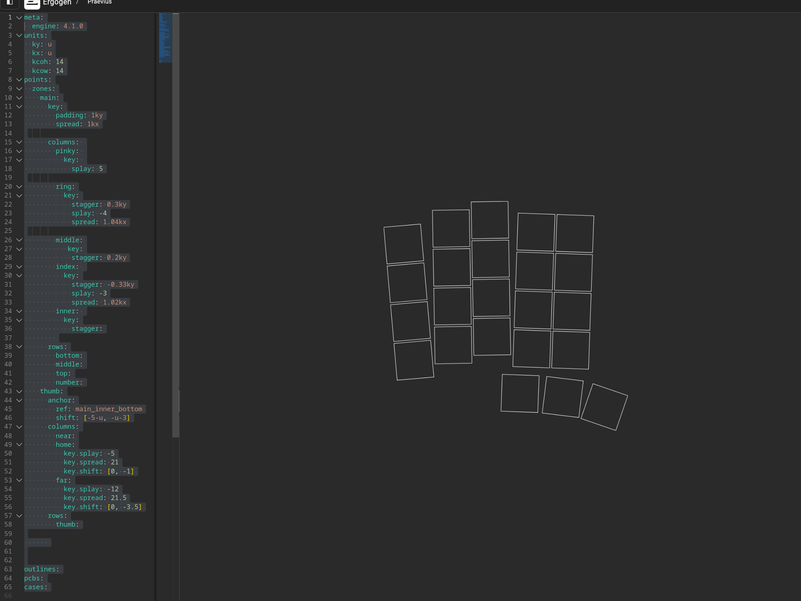

**Total  time spent: 3 hours**

# September 5: Re-thinking Constraints 

  Been having some doubts regarding which switches to use. I was looking at the ZSA Voyager and carrefinho's Forager as inspiration, but I just realized that they are not as low profile as I thought. The Voyager has a height of 16 mm including keycaps while the Forager has a height of 17.5 mm. For reference, my Fulmen with KS33 switches and low profile keycaps is 20 mm. The only way to further reduce this would be to use ULPs or Kailh PG1316s, but what I don't like about those is that you lose almost all travel, and after several hours of typing your fingers will probably feel like you are hammering a solid plate. I think for this the best course of action would be to scrap the onboard MCU idea, and basically make this the successor of Quaero. If I use something like Choc V2s as well as touchpad, it will be "bulky" enough so that I can hide a xiao without it appearing bigger, kind of like the Forager does it. Having onboard NRF52840 would not really add any benefits in this case, as I can't make it thin enough for it to matter because of the Chocs and touchpad. And the PCBA will drive the price up pretty bad. A Seeed Studio Xiao NRF52840 is only like $10, which isn't that expensive. 

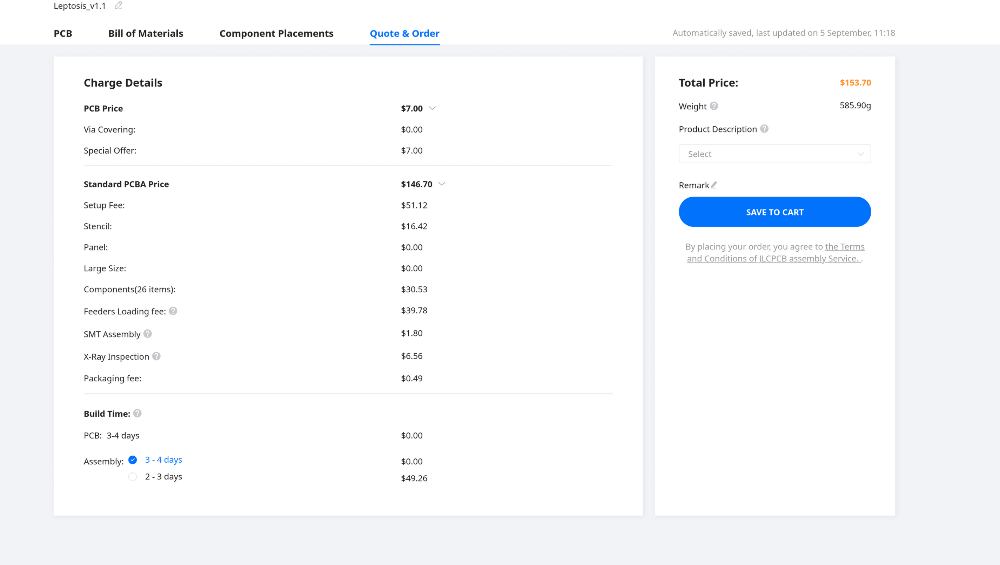
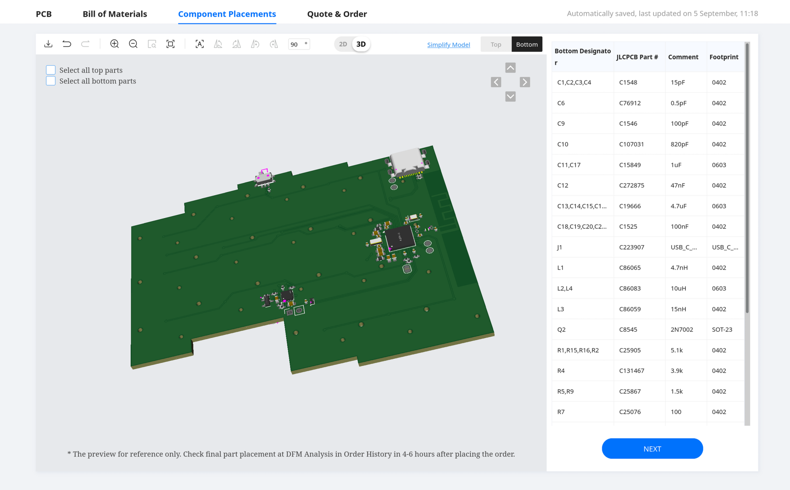

  Yeah I was right. No way I'm doing PCBA. A standard PCB would cost me at most $40, and that plus the NRF52840 would be $60, which is less than half of what PCBA would be. I uploaded the prod files for Cyao's Leptosis which to get this quote, which is pretty similar in terms of components to what mine would be if I used PCBA. The benefits of PCBA simply do not justify the cost. Maybe if there was version of the NRF52840 that was easier to solder I'd still do an onboard MCU just for fun and for the learning experience, but there isn't, so dev board it is. Regarding the pin issue: the keyboard will have 27 keys (per half), so 6 columns and 5 rows, meaning 11 pins need for each half. The touchpad needs RDY, RST, SDA, and SCL pins, as well as ground and power. So I need 15 for the touchpad half. Unfortunately, the Xiao NRF52840 only has 11 GPIOs. But it seems that they also have a Plus version of the latter, which offers 9 extra pins using smaller pads between the orginal main pads. And it only costs 50 cents more! So I've got a couple of options: use the Plus for both sides, use the Plus only for the touchpad side, make the PCB reversible and use the Plus for both sides, or make the PCB reversible and also compatible with both the Plus and the standard. I'm leaning towards the latter option, as it's the most efficient and cheapest one. As I'll be losing some complexity because of switching to a dev board, I think I'll make the number row as well as the outermost column detachable. 

**Total  time spent: 1 hour 30 minutes**

# September 6: Layout 

Tweaked the layout a bit more, and then exported a dxf to Onshape and created a rough test plate, which I then printed. I added some keycaps and Gateron KS33 low-profile switches to test the feel. 
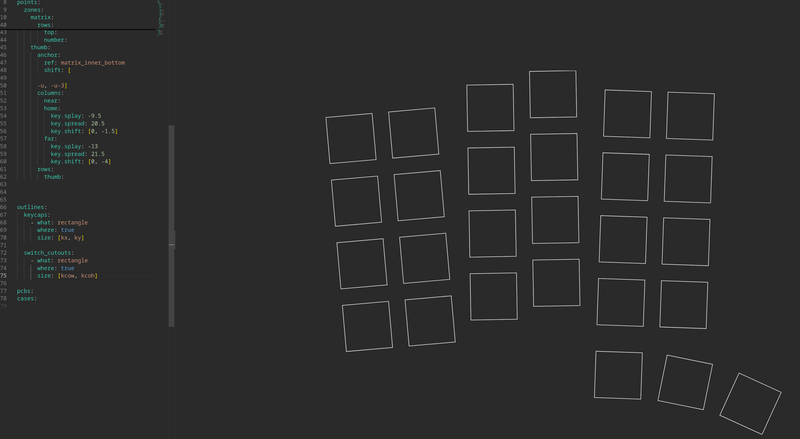
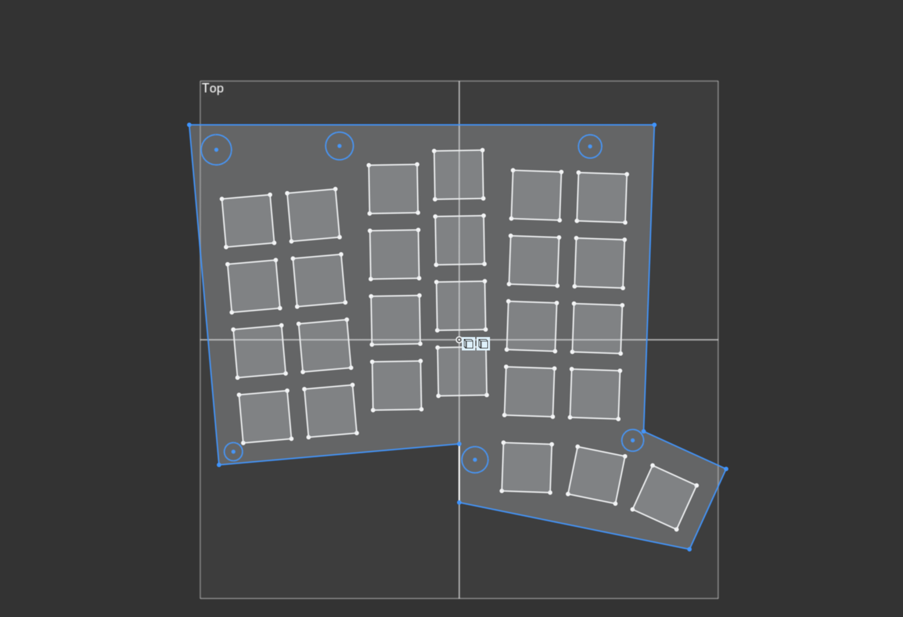
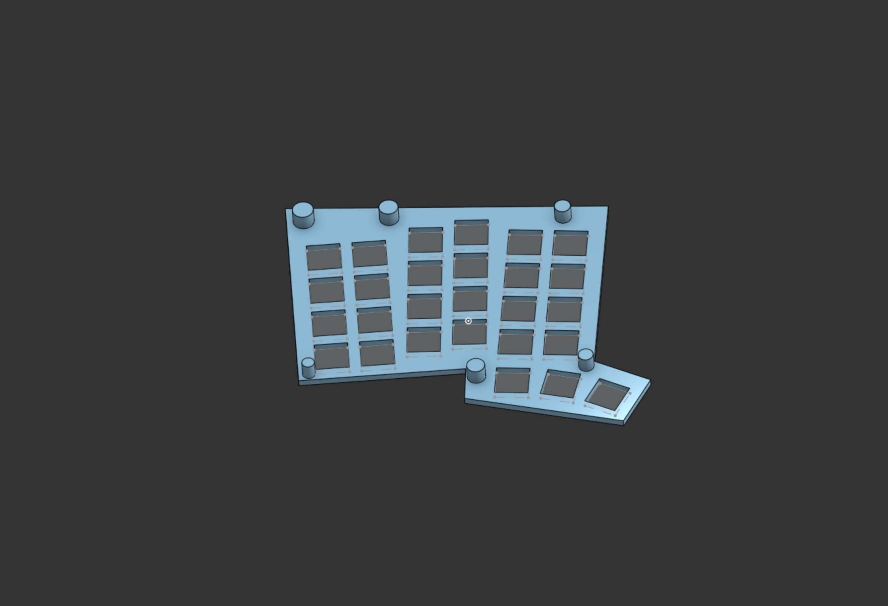
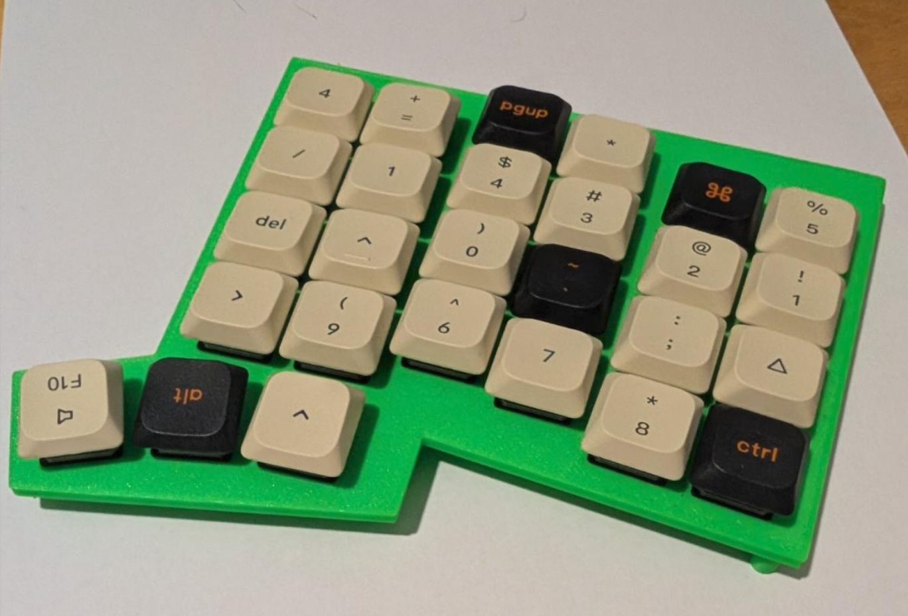
After testing it, my father requested some minor changes, such as reducing the stagger of the index and ring finger columns relative to the middle finger column. I was also able to convince him to drop the number row, but I left the outer columns. I'll just make that a breakaway column. I've decided I'll use Choc v1s for this because of the smaller keycap size. The layout shown below still uses Gateron KS33 sizing, as I want to print another plate and test it before switching to Choc. 
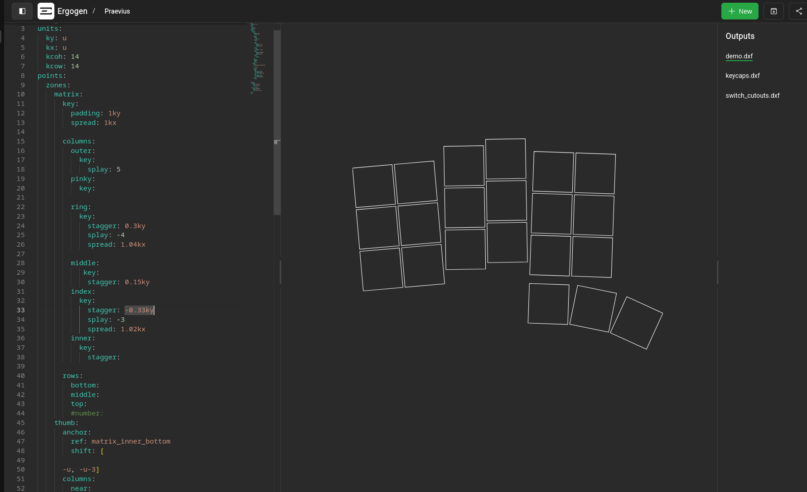

**Total  time spent: 1 hour**

# September 11:

The main issue at hand for now is the MCU footprint. Haven't been able to find an existing reversible footprint for the NRF52840 Plus, so I'll have to make one myself. Did a bit of research on that, and also made and printed some more test plates. Here's a pic of all I've made so far, with my Fulmen keyboard on the left for reference. It's a rather tedious process, but worth it for a comfortable fit. The one in which I currently have all the switches and keycaps is the final version. 

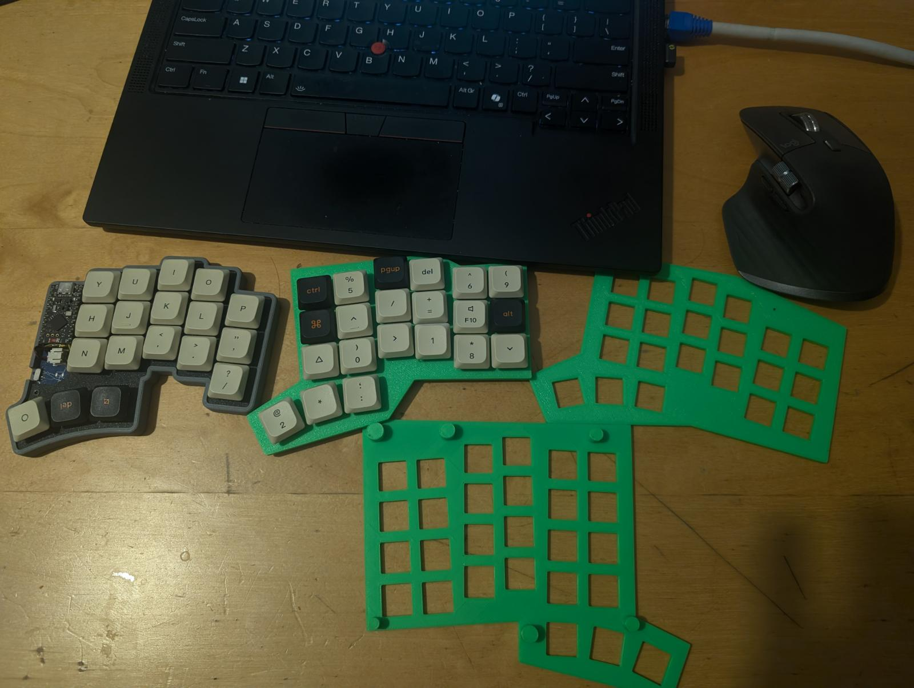
**Total time spent: 30m**

# September 16: Reversible MCU footprint
Imported the erogen layout into KiCAD. 

Now I have to figure out the MCU footprint. Because of the castellated extra pins on the nrf52840 Plus, the main option would be to solder it using solder paste and a stencil. Issue is, stencils are not cheap (probably going to be about $10 from JLCPCB). But I think I could hand-solder it using a fine tip by using a footprint with large enough pads and holding the tip in the small notches of each pin. Found [this](https://www.youtube.com/watch?v=WMBia66Qavs) video after a quick search, in which the guy does essentially exactly what I was thinking. So it's definitely possible to hand-solder it.
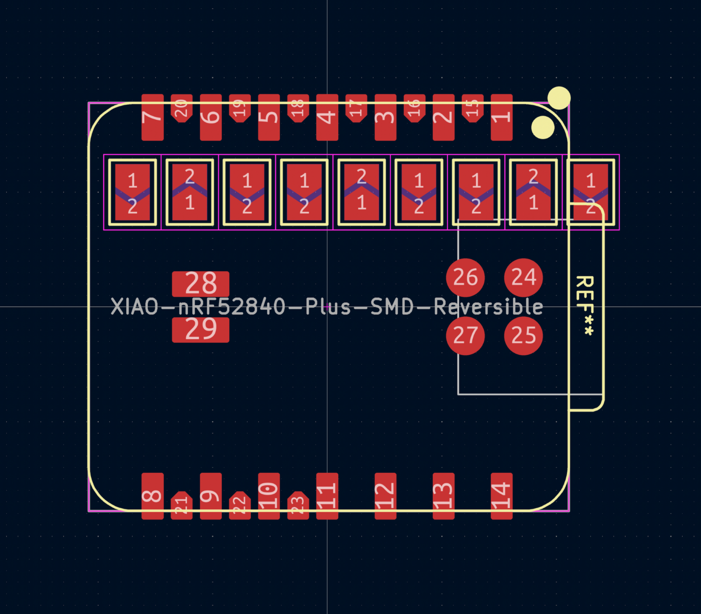
So essentially I've got a couple of problems if I want to make this reversible, as you can see in the above picture. So the jumpers I've placed above the nrf footprint for reference are 1.5 mm (the red part) and 3 mm (the purple/pink outer boxes) wide. These are the default open jumpers. Now I've got 9 of them in this pic, but 13 pins on that side of the MCU. So yeah 13 of those jumpers obviously won't fit inside the nrf's footprint. What I'm thinking is I'll make even smaller jumpers (0.8mm for the red part or reduce the spacing) and just use a finer tip on my soldering iron. Not 100% sure how doable this is though. If I want all pins to work, I also need too add those small pads between the large pads that you can see in the upper half to all of the lower half. That should be pretty simple though: just mirror the top pads. Another idea I just thought of would be to offset the jumpers. So maybe something like this:
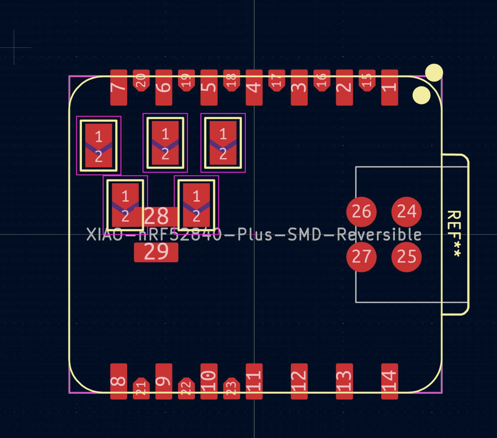
But I'll have to see if the spacing for the traces and vias that come in between opposing pads allows this. Might be feasible with smaller jumpers nonetheless. 

**Total time spent: 1 hour 5 minutes**

# September 26: MCU Footprint
After some brainstorming, I realized that instead of spending time struggling with creating a custom jumper footprint that's both small enough to fit and large enough to hand solder I could just use the existing pads as one half of the jumpers and make the other half the same size and spacing as the pads. Messed around a bit with the idea in KiCAD and I think it's doable, especially if also offset the jumpers, as mentioned above. 
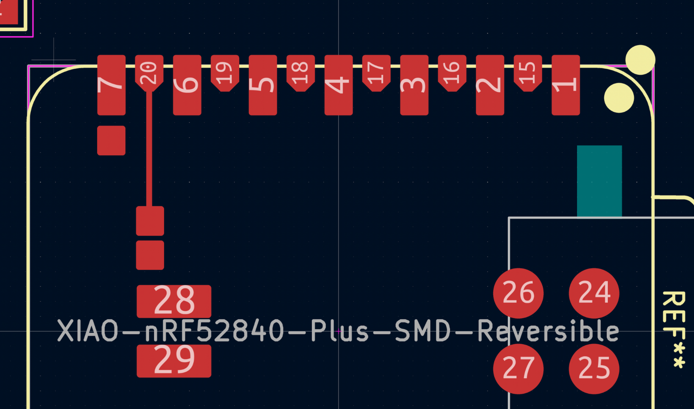
As you can see in this screenshot, for the large pads I'll be using the pad itself as one half of the jumper and then adding a smaller custom pad of the same width for the other half. For the smaller pads, I'll use a trace to offset the jumper relative to the large pad jumpers and then just use a small custom jumper (again, same width as the pad). 
After deciding on this approach, I attempted to modify the existing large pads into an arrow shape, to make bridging the jumper easier. And this is where things got complicated: I couldn't for the life of me figure out how to properly align and join a triangle to the existing jumper. I messed with the grid size, placed and used reference points, tried multiple shapes, but I still couldn't get it right. I could get it roughly right, but not perfect. I now realize I should have stopped at "good enough", but I guess my OCD didn't let me haha. Also, it seems I'll have to copy and paste these edited pads manually, as there is no mass edit tool for this.

**Total time spent: 1h 20m**

# September 27: MCU Footprint (continued)
Continued working on the jumpers and pads. For the distance between jumper halves, I referenced the default KiCAD jumper gap, 0.3 mm. Did a lot of positioning and struggling with KiCAD's reference and snap system, but eventually got the hang of it. I forgot about the "Position interactively with offset" tool initially, which would have saved quite a lot of time. The good news is that everything will go much quicker from now on. Here's what I've done so far:
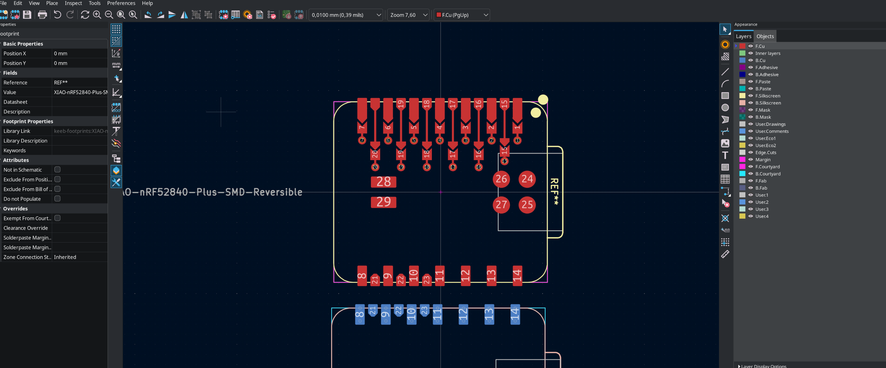
Note to self: add solder mask front and back between the jumper halves, and double check manufacturing tolerances. I need to be able to fit traces between the pads to get to the jumpers.

P.S. Can't add two lapse links through the Forge UI unfortunately, so here's the link to the other lapse session from today https://lapse.hackclub.com/timelapse/ts0Ra3_rEeMy. 
**Total time spent: 3h 20m**

# Octomber 1: Reality Hits
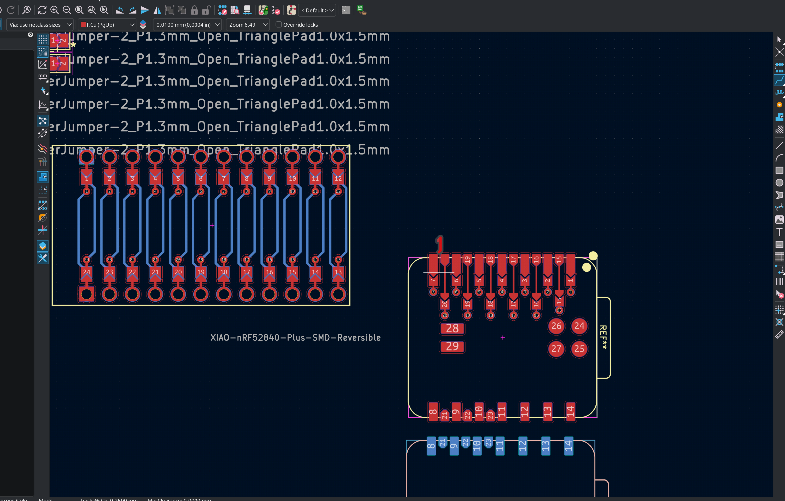
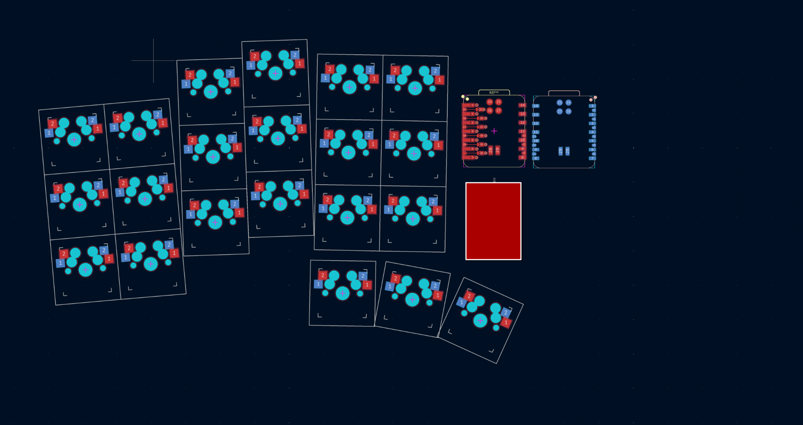
  So turns out I'm really dumb. As you can see in the above picture, traces don't fit between the pads. HOW IN THE WORLD DID I NOT THINK OF THIS BEFORE?!?!? Now I basically have to scrap the whole reversible idea and all the work I've done so far. I could technically maybe still make it reversible by adding the jumpers below the MCU, but then I'm not saving space at all. It'd be better to just use a pro micro sized board at that point. I guess I probably should focus more on just one project in the future to avoid dumb mistakes like this. Anyway, it's not that great of a tragedy, because the PCB will be only like $10 more expensive. I'll have four leftover PCBs gathering dust but it is what it is. Since now my initial idea of an onboard MCU and my subsequent reversible idea have proven unpractical, I guess I should just try and focus on polish, and make this as polished as possible. Oh and another thing I want to do is add some sort of button on the outermost side of the thumb portion, placed horizontally (perpendicularly with the last thumb switch). That way I'll have another button for right clicking and stuff. Saw the idea on reddit quite some time ago and thought I'd try and replicate it as it might be helpful when paired with the touchpad. I think it work exceptionally well paired with a trackpoint, as you wouldn't have to move your hand as much as with a trackpad, but I already bought the trackpad so I'll have to use that. I've also thought about using gaskets for a more cushioned/silent feel, but I'd be sacrificing too much height.  

**Total time spent: 30m**

# Octomber 2: Starting Schematic 
  I'm going to take a lot of inspiration from the Forager keyboard, as I really like the design. If I put the Xiao on the back similarly to the Forgager then I can make the case much more minimal, and it also removes the need for a MCU cover, which is great as I can't never seem to get those right. Disadvantage being that it'd raise the minimum height by a bit, and I can't do a bare PCB bottom. But since I'm planning on making an arm/pivot clamp thing for these I'll need space on the bottom to add magnets anyway, so that should be fine. Oh and another idea: maybe make the trackpad slightly slanted so that it's more comfortable to move to with the index and middle fingers.
  I just realized I can't position the MCU like on the Forager, because I want to have a breakaway column (see first pic) so I guess I could put it as shown in the second pic (case would look a bit wonky though, and I might have to increase the stagger to get more space):

  Today was mostly working on schematic and brainstorming the above. Tedious stuff unfortunately...I really wish I could somehow select several of the same symbols and just like add a letter instead of having to edit each manually. Eg. mass edit all diode references from "D1, D2, D3, etc" to something like "LD1, LD2, LD3, etc" for the left half.
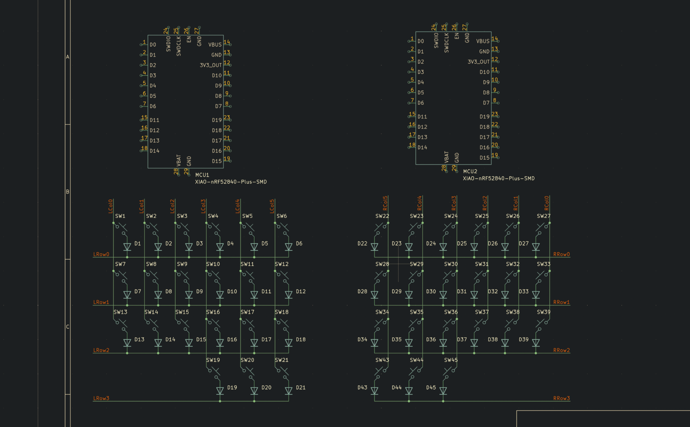

**Total time spent: 1h 15m**

# Octomber 3: Switch Footprints and Positioning 
  Alright, so I recently came up with this idea:
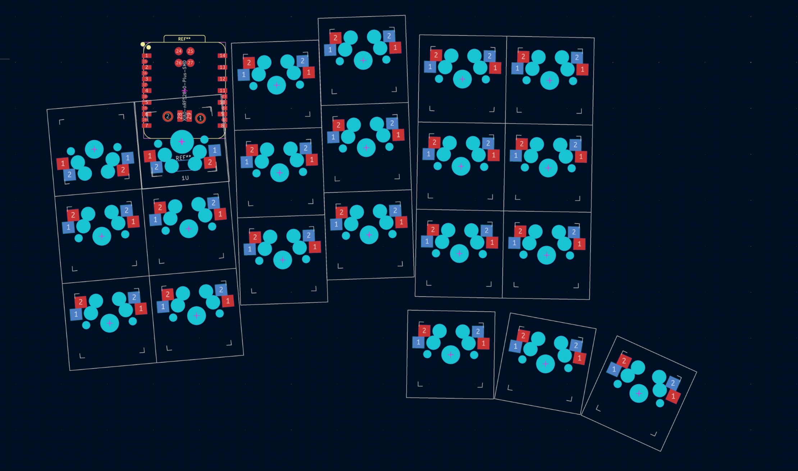
Basically, why shouldn't I make this work with MX switches as well as ks33 low profile switches? Then I could reuse the PCBs I have left over, as I currently have like 45 MX switches from a previous handwired build. Yes it would make routing a bit more difficult, but I think it's manageable. Now the obvious problem is that if I position the MCU as in the above picture, the MX pin holes of the top-most pinky column switch would overlap with the MCU. But If I clip them and put solder only in the holes it should be doable. Janky I know, but worth it in my opinon. Or maybe I could add hotswap pads for the MX switches as well? Arghhh too much scope creep!!
  If I use a 301230 battery (as shown in the picture below), it would fit perfectly, but I'm a bit worried about the battery life. I have that size on my Fulmen keyboard, and while the battery life is decent it's not great. And it would be much shorter with a trackpad. The Beekeeb Toucan 2 has a trackpad though, and after looking it up it seems it's a 401730. Now I was thinking that I could use a 3 series battery, but I also just noticed that the Forager uses a 4 series battery placed on the back of the PCB, with no cutout. So 4 mm tall battery should not raise the height of the keyboard as I initially thought, especially if I add a battery cutout in the PCB. I'll just use the same size battery as the Toucan. Should be alright.
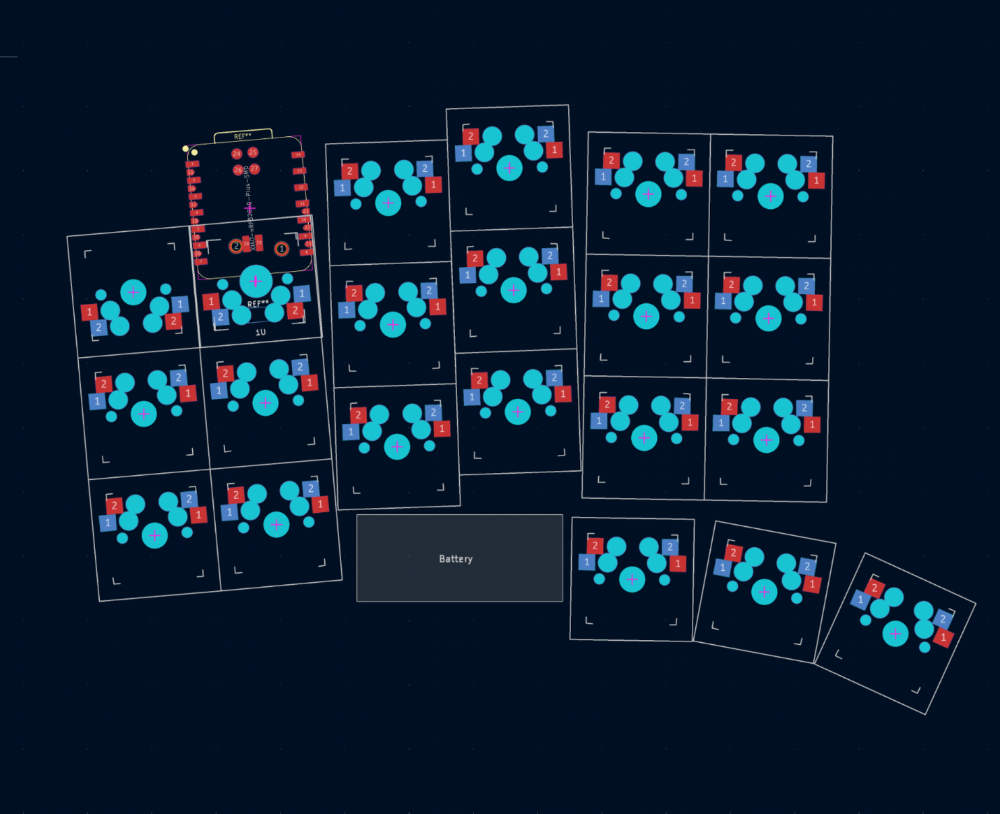
  I've made some footprints, or more accurately mashed some footprints together. Basically, I took Gateron KS33 Hotswap, KS33 Solderable, and MX Solderable footprint from [ai03's MX_v2 library](https://github.com/ai03-2725/MX_V2/tree/main/Gateron_KS33_Hotswap.pretty) and mashed them together in order to create a Gateron KS33 Hotswap + MX Solderable footprint (below left) and a Gateron KS33 Hotswap + MX Hotswap footprint (below right).  
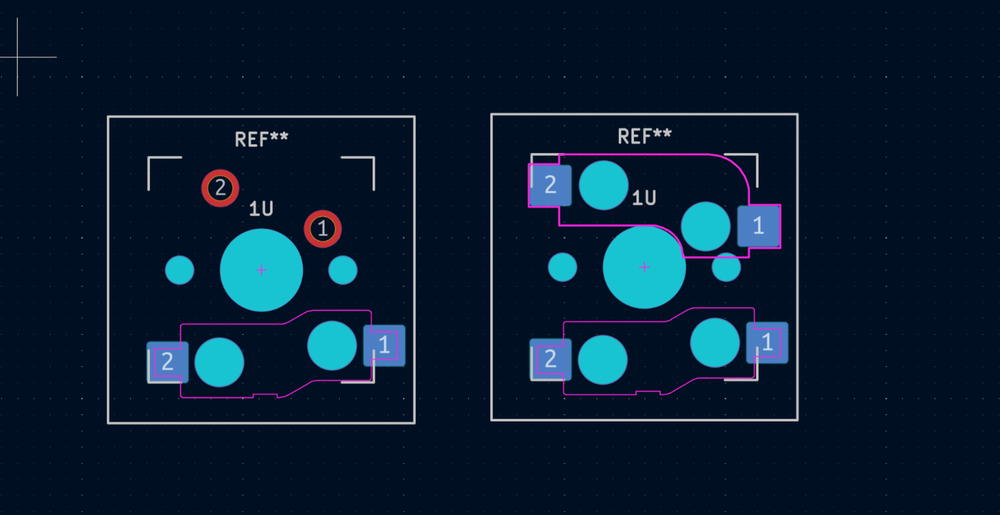
  I also isolated and exported the component outlines I need to reference to create the board outline using the plot tool. Exported the result as a .dxf, and tomorrow I'll import it into Onshape or Freecad, create an outline referencing said DXF, and then import that back into KiCAD. I'm currently split between Onshape and Freecad though, as if I'll end up with 4 extra PCBs and I already have a bunch of components from previous builds I might want to build and sell a keyboard or two in order to get rid of them. Issue is, if I design the case in Onshape I won't be allowed to do that at all. But if I make it in Freecad then it'll take me at least twice the time it would in Onshape. Anyways, I'll that out tomorrow. 

**Total time spent: 2h 30m**

# Octomber 9: Diode Footprint and Assigning References
  Seeing as how the outline is rather tricky and I don't want to mess with FreeCAD right now, I think I'll route the first half and then make the outline before mirroring the other half. Changed all the reference values of the switches on the PCB to match the matrix order of the schematic for the first half, and routed the columns. Also made a that allows using either a DO-35 7.62 mm or SOD-123 1N4148 diode. Also, I was looking at the Forager and just now realized that it usese SMD nuts. Might be worth making sure I use a mounting hole footprint that allows me to use those, as they seem pretty nice. I like the ideas of screws on the bottom and not having to mess with standoffs or heat inserts. Or maybe I could try gaskets.
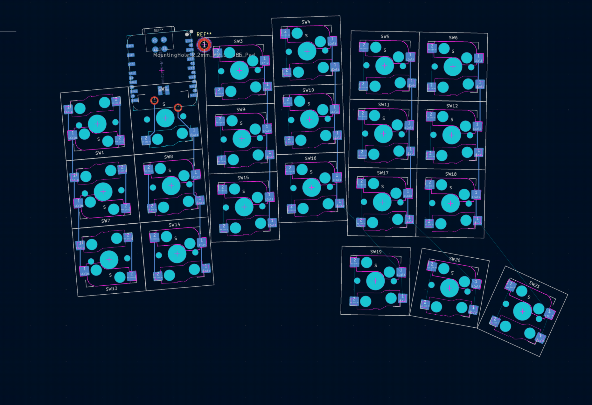
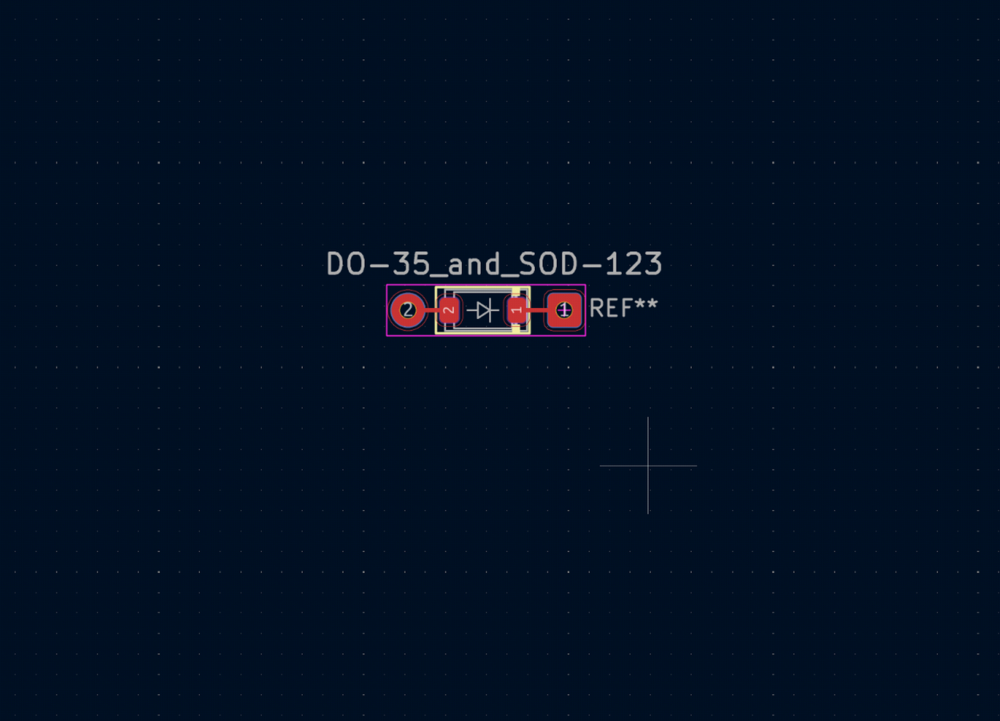

**Total time spent: 1h**
   
# Octomber 10: More Routing and Trackpad Research
  I've come to the conclusion that I want to use SMD pads. The only issue with this would be that if I want to use some other form of mounting in the future I can't, because the holes necessary for these nuts are 3.6 mm. I might be able to use M3s though. Anyway, so what I'm thinking is that I'll add a series of holes for nuts, and also some plain M2 mounting holes. That way I can choose between one or the other for each PCB. Yes, routing will be more annoying, but I think it's doable. Oh and I just realized something: if I use SMD nuts, then I can even use one of the spare PCBs as a bottom plate for a more "hardware" look. Should have add some good silkscreen then.    
  Tried seeing if I have enough space to make a 402030 lipo fit, as these are more readily available, but unfortunately I do not. I'll have to stick to the 401730. Looked at the Ergonaut keyboard and for the battery cutout it uses a +2 mm tolerance. 
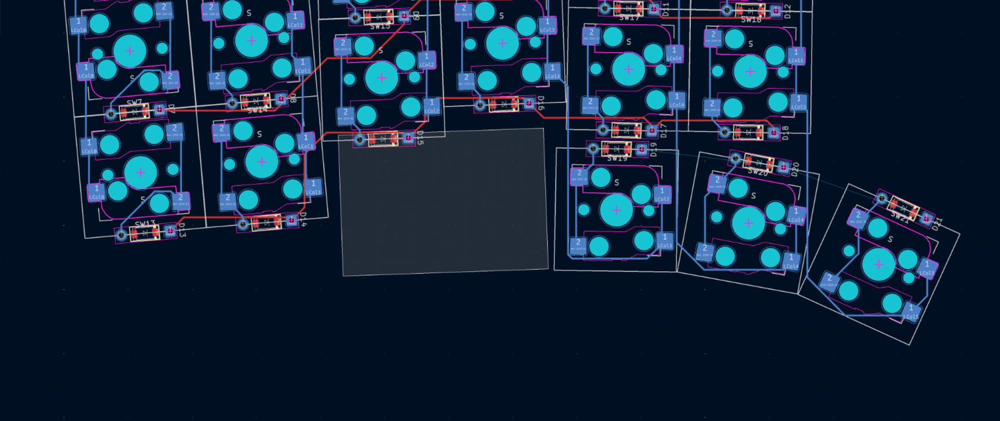
  Did some more routing, and started researching the trackpad stuff. So far by looking at the rather sparse datasheet and searching online I've been able to find that the Azoteq TPS65 has a FFC 1x06 connector on it with a 0.5 mm pitch and a ZIF lock. I still need to figure out its contact side: (top or bottom). I think I'll keep my options open, and add a matching FFC connector as well as solderable pads. Can't hurt. I initially tried searching for github repos of keyboards that also use this trackpad model in hopes of finding out the exact part they use for the FFC connector, but no luck. Oh and I also edited the diode footprint I made last time so that it looks nicer and is positioned correctly (pads were on the front instead of the back by default for the SMD diode). I still have to figure out how to properly connect the SMD pads to the THT pads in the footprint....DRC didn't seem too happy about my footprint.

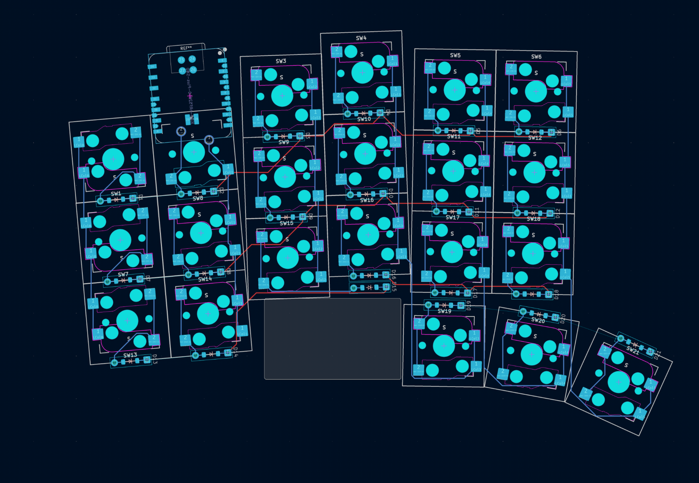

**Total time spent: 2h 50m**

